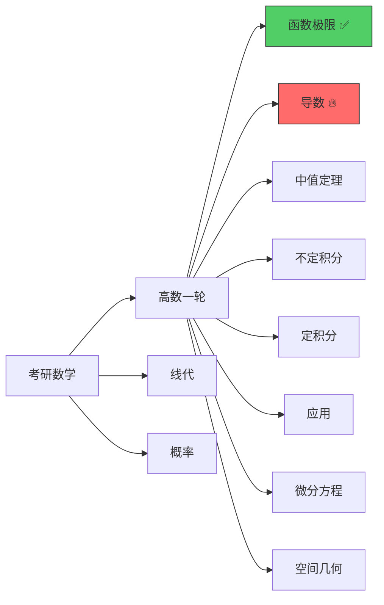

<h1 align="center">👋 你好，我是 code-slaveboy</h1>
<h3 align="center">SakuraFish · 考研数学 · C/C++ · Go · 菜就多练</h3>

<p align="center">
  
  
  
  
</p>

---

## 🧑‍💻 关于我

```yaml
name: "SakuraFish / code-slaveboy"
location: "China"
status: "🔥 考研数学冲刺中"
focus:
  数学: "高数一轮 → 线代 → 概率"
  编程: "C++ 深耕 · Go 进阶 · 自部署折腾"
blog: "light.sakurafishermua.top"
github_stars: "93 repos × 19 categories"
motto: "I hear and I forget. I see and I remember. I do and I understand."
```

---

## 📊 GitHub 统计

<p align="center">
  
  
</p>

<p align="center">
  
</p>

---

## 📕 考研数学进度

### 高等数学（一轮复习）

| 章节 | 进度 | 完成度 |
|:----|:----:|:------:|
| 第一章 · 函数与极限 | 已完成 | 🟩🟩🟩🟩🟩🟩🟩🟩🟩🟩 100% |
| 第二章 · 导数与微分 | 进行中 | 🟩🟩🟩🟩🟩🟩⬜⬜⬜⬜ 60% |
| 第三章 · 微分中值定理 | 待开始 | ⬜⬜⬜⬜⬜⬜⬜⬜⬜⬜ 0% |
| 第四章 · 不定积分 | 待开始 | ⬜⬜⬜⬜⬜⬜⬜⬜⬜⬜ 0% |
| 第五章 · 定积分 | 待开始 | ⬜⬜⬜⬜⬜⬜⬜⬜⬜⬜ 0% |
| 第六章 · 定积分应用 | 待开始 | ⬜⬜⬜⬜⬜⬜⬜⬜⬜⬜ 0% |
| 第七章 · 微分方程 | 待开始 | ⬜⬜⬜⬜⬜⬜⬜⬜⬜⬜ 0% |
| 第八章 · 空间解析几何 | 待开始 | ⬜⬜⬜⬜⬜⬜⬜⬜⬜⬜ 0% |
| **总进度** | | **🟩🟩⬜⬜⬜⬜⬜⬜⬜⬜ 20%** |

> 📐 复习策略：艾宾浩斯六轮法（当晚R1 → 1天R2 → 3天R3 → 1周R4 → 2周R5 → 考前R6）

---

## 🎯 学习路线图



---

## 🛠️ 技术栈

### 编程语言

```
C/C++    ████████████████████████░░  88%  ⚡ 主力语言
Go       █████████████████████░░░░░  78%  🚀 进阶中
Python   ██████████████████░░░░░░░░  65%  🛠️ 辅助工具
Shell    ██████████████░░░░░░░░░░░░  45%  🐧 运维脚本
TypeScript███░░░░░░░░░░░░░░░░░░░░░░  15%  📝 偶尔写写
```

### 工具与环境


---

## 🖥️ 我的装备

| 类别 | 工具 |
|:----|:-----|
| 🐧 OS | Debian 13 (Server) |
| 🐳 面板 | 1Panel — Docker 容器管理 |
| 📝 博客 | Hugo + Reimu 主题 + KaTeX |
| ✏️ 笔记 | 费曼学习法 → 博客归档 |
| 💻 终端 | starship prompt + superfile |
| 🔧 编辑器 | VS Code / SSH |
| 🎮 娱乐 | 阴阳师 · B站 · 漫画 |

---

## 📝 最新博客

> ✍️ **[light.sakurafishermua.top](https://light.sakurafishermua.top)** — 用费曼学习法记录考研数学

近期文章：
- 🔜 第二章 · 导数与微分复习笔记（撰写中）
- ✅ 第一章 · 函数与极限总结
- ✅ 无穷小比较的常用技巧
- ✅ 考研数学复习方法论

---

## 🏆 成就

| 徽章 | 说明 |
|:----:|:------|
| ⭐ **93 Stars** | GitHub 收藏系统化管理，分19类 |
| 📖 **考研数学** | 高数一轮复习进行中，艾宾浩斯六轮法 |
| 🏗️ **自部署** | 1Panel 管理 Docker 容器 + Hugo 博客 |
| ✍️ **技术写作** | 费曼学习法输出博客文章 |
| 🗂️ **仓库治理** | 删繁就简，从零重构仓库体系 |

---

## 🌱 成长记录

| 时间 | 里程碑 | 状态 |
|:---:|:------|:----:|
| 🎯 2025.07 | **考研数学一轮复习** — 高数出发 | 🔥 进行中 |
| 📚 2025.06 | 整理 GitHub Stars 分类（93个→19类） | ✅ 完成 |
| 💻 2025.05 | 搭建 Hugo 博客（Reimu 主题） | ✅ 完成 |
| ⚡ 2024 | C++ / Linux / Go 基础学习 | ✅ 完成 |
| 🚀 2024 | 开始折腾 1Panel / 自部署 | ✅ 完成 |

---

## 🐍 贡献蛇图

<p align="center">
  
</p>

---

## 📫 联系我

<p align="center">
  <a href="https://github.com/code-slaveboy">
    
  </a>
  <a href="mailto:1660727793@qq.com">
    
  </a>
  <a href="https://light.sakurafishermua.top">
    
  </a>
  <a href="https://github.com/code-slaveboy?tab=stars">
    
  </a>
</p>

---

<p align="center">
  <i>"I hear and I forget. I see and I remember. I do and I understand."</i>
  <br>
  <b>— Confucius</b>
</p>

<p align="center">
  <sub>📐 考研路上，每一步都算数</sub>
</p>
